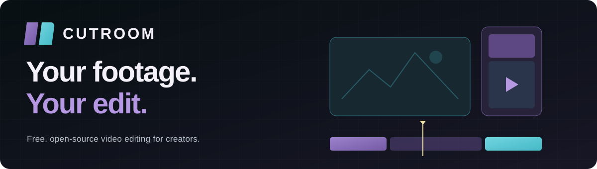
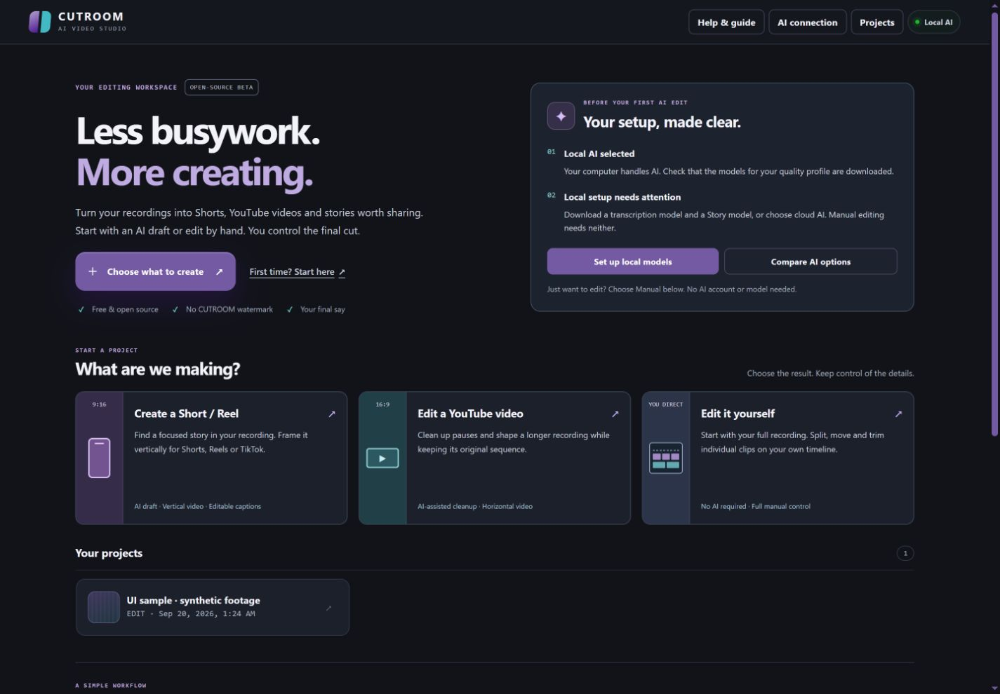
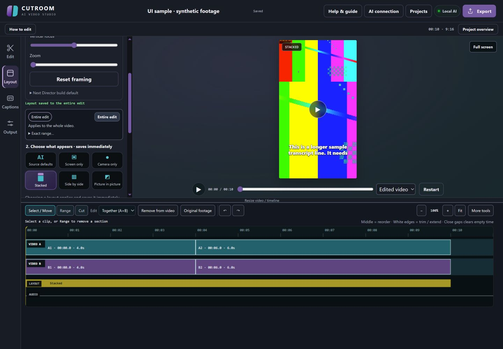
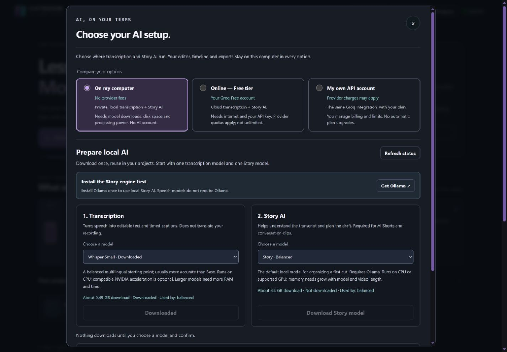

<p align="center">
  
</p>

<p align="center">
  <strong>A free, local-first video editor for creators.</strong><br>
  Get a head start with AI. Keep control of the final cut.
</p>

<p align="center">
  <a href="CHANGELOG.md"></a>
  <a href="docs/BETA_STATUS.md"></a>
  <a href="LICENSE"></a>
  <a href="https://cutroom-studio.expo.app/#download"></a>
  <a href="#choose-how-ai-works"></a>
</p>

<p align="center">
  <a href="https://cutroom-studio.expo.app/">Website &amp; download</a> ·
  <a href="docs/USER_GUIDE_EN.md">User guide</a> ·
  <a href="https://github.com/VanoPeradze/cutroom/issues/new/choose">Report an issue</a> ·
  <a href="docs/README.md">All guides</a> ·
  <a href=".github/CONTRIBUTING.md">Contribute</a>
</p>

---

CUTROOM helps turn camera recordings, screen captures and gameplay into an **editable first cut** for YouTube, Shorts and Reels. Start with an AI-assisted draft or open the full recording and edit by hand. Move the clips, correct the captions and frame each moment your way.

**No CUTROOM subscription. No CUTROOM watermark. MIT-licensed source.** Optional cloud AI uses your own provider account; its quotas and charges are separate.

> **This is a beta, not a one-click promise.** AI selections and transcripts need review. Start with a short recording, keep your originals, and watch the exported file before sharing it.

## A look inside



*The real CUTROOM interface. Choose your output, prepare your AI setup, or start editing without AI.*

<details>
<summary><strong>Explore the editor and AI options</strong></summary>

### Your clips, your decisions



*An actual editor screenshot using synthetic test footage. The color bars demonstrate the interface and are not an example of AI editing quality.*

### AI on your terms



*The setup panel explains downloads and provider choices. This example shows local Story AI still needing setup; models are not bundled with CUTROOM.*

</details>

## Built around your footage

| What you want to do | What CUTROOM offers |
| --- | --- |
| Make a YouTube video | Start in 16:9 and clean up a recording while keeping its original sequence. |
| Create Shorts or Reels | Start in 9:16, review AI-selected moments, adjust framing and add captions. |
| Combine camera and screen | Use two recordings or define an embedded-camera region; review roles, layout and sync. |
| Make the edit your own | Split, move, trim and restore independent clips; edit A/B together or separately, with Undo/Redo. |
| Finish the details | Correct the transcript, style captions and export subtitles as SRT. |
| Export your video | Create 720p or 1080p MP4s, with frame-rate options up to 60 FPS. |

Lower-frame-rate footage does not gain new motion detail when exported at 60 FPS.

## Get started

1. **[Download the Windows beta](https://cutroom-studio.expo.app/#download)** and extract the entire ZIP.
2. **Double-click `START CUTROOM.bat`** in the extracted folder and follow the setup prompts. The editor opens in your browser when ready.
3. **Choose a workflow.** Start with **Manual edit**, or prepare AI and choose **Short / Reel** or **YouTube video**.

The ZIP contains source code, not an all-in-one offline installer. First setup needs internet and downloads dependencies; local AI models are additional, optional downloads. Keep the launch window open while editing and use the same launcher next time.

The download opens to just three items: **START CUTROOM.bat** to launch, **START HERE.html** for a readable offline guide, and **App** for the technical files and saved work. Keep them together; no need to open App for everyday use. If Windows hides extensions, the launcher appears as **START CUTROOM**.

Using a GitHub source checkout or an older flat-folder download? Its developer launcher remains `run_windows.bat`. The new folder layout does not move or modify existing installations.

**First edit:** add footage → review or build a draft → refine clips and captions → export and check the result.

[Complete walkthrough](docs/USER_GUIDE_EN.md) · [Installation help](docs/TEST_ON_ANOTHER_PC.md) · [Keyboard shortcuts](docs/KEYBOARD_SHORTCUTS.md)

## Choose how AI works

The editor and rendering stay on your computer in every mode. Open **AI connection** to see what is ready and what needs setup.

| Mode | What you need | What to expect |
| --- | --- | --- |
| **Manual editing** | Your footage | No AI models or AI account. Open the recording and start cutting. |
| **Local AI** | Downloaded models and enough computer resources | Transcription and Story AI on your machine, with no provider fees. |
| **Optional cloud AI** | Your Groq account, or a compatible provider endpoint and API key | Groq Free tier is free within its quotas; paid accounts and other providers may charge. |

Local models download only after you choose and confirm them. Selecting local mode alone does not install them. When you opt into cloud processing, selected audio and transcript/editing context are sent to the provider. CUTROOM does not automatically switch your provider or billing plan. Keys entered in the application last for the current session and are bound to the selected destination. Changing provider or endpoint requires a new key and consent.

**My own API account** supports Groq or a public HTTPS endpoint compatible with OpenAI's chat and timed-transcription APIs. Both models must work through the same endpoint and account; a chat subscription alone is not an API connection. See the requirements in the connection guide below.

Thanks to Groq for making a free API tier available. CUTROOM is independent and is not sponsored or endorsed by Groq. [Groq rate limits](https://console.groq.com/docs/rate-limits) · [Billing FAQ](https://console.groq.com/docs/billing-faqs)

[AI setup and privacy](docs/AI_CONNECTIONS.md) · [Model choices and download sizes](docs/MODELS.md)

## Where the beta stands

The workflow is available to try; the quality still needs real-world feedback.

- Transcription and draft quality vary with language, noise, overlapping voices and recording length.
- Camera detection, source roles, synchronization and suggested cuts may need manual correction.
- Editing styles are pacing and selection presets, not replicas of individual creators.
- There are two video sources, not unlimited professional editing tracks.
- Fresh-computer installation and broad hardware coverage are still being validated.

Use copies of your footage, not your only originals or an urgent client delivery. Automated tests and synthetic renders do not establish professional editorial quality.

[Detailed beta status](docs/BETA_STATUS.md) · [Known quality limits](docs/QUALITY_AND_LIMITS.md) · [Changelog](CHANGELOG.md)

## Help shape CUTROOM

**Creators:** try one short project and tell us where the workflow helped or got in your way. [Report a reproducible bug](https://github.com/VanoPeradze/cutroom/issues/new/choose) or use the [tester feedback guide](docs/BETA_FEEDBACK.md). If the repository is not accessible yet, send feedback to the person who shared your beta download.

**Contributors:** help improve timeline interactions, setup, accessibility, transcript evaluation, documentation or tests. Start with the [contribution guide](.github/CONTRIBUTING.md). Discuss larger changes before building them.

**Security reports:** follow the [security policy](.github/SECURITY.md). Keep credentials, client footage, transcripts and personal file paths out of public issues.

<details>
<summary><strong>For developers</strong></summary>

The editor uses a Python backend, a plain JavaScript frontend and FFmpeg rendering. AI integrations are optional. See the [developer setup and checks](docs/CONTRIBUTING.md) before making changes. Just want to edit a video? Use the Windows beta download above; the folders below are for contributors.

```text
cutroom/       Editing, transcription, jobs and rendering
web/           Local editor interface and timeline
tests/         Backend, frontend and synthetic-render regression tests
scripts/       Validation and privacy-conscious packaging tools
docs/          User guides, limitations and contributor documentation
packaging/     Windows download launcher and offline help
website/       Separate Expo-hosted presentation and download site
.github/       Community guidelines and automated repository checks
```

Repository checks cover documentation, frontend regressions and the website download helper. Full backend tests, synthetic renders and clean-machine testing are separate checks; none proves real-world AI quality.

</details>

## License

CUTROOM is released under the **[MIT License](LICENSE)**. You can use it, study it, modify it and redistribute it under that license. Third-party tools and AI models retain their own licenses; see [Third-party notices](docs/THIRD_PARTY_NOTICES.md).

<p align="center"><strong>Built for creators. Shaped by the people who use it.</strong></p>
