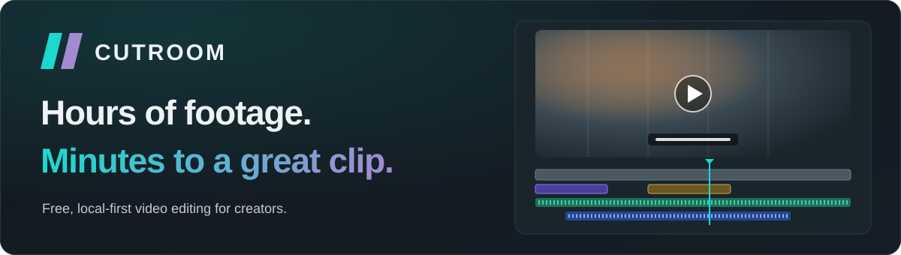
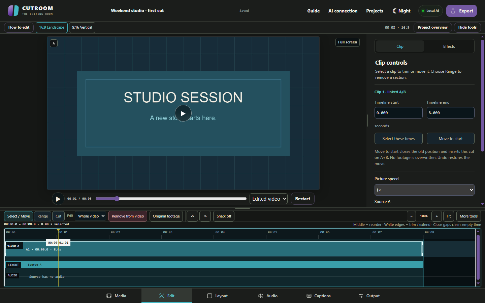

  

  <strong>A free, local-first video editor for YouTube, Shorts and Reels.</strong> 
  Bring your recording. Build an editable cut. Make it yours.

  
  
  
  
  

  <a href="https://cutroom-studio.expo.app/">Website &amp; download</a> ·
  <a href="docs/USER_GUIDE_EN.md">User guide</a> ·
  <a href="docs/PLATFORMS.md">Platform setup</a> ·
  <a href="https://github.com/VanoPeradze/cutroom/issues/new/choose">Report an issue</a>

CUTROOM turns camera recordings, screen captures and gameplay into an **editable first cut**. Start by hand or use optional AI for a draft, then keep control of the clips, framing, sound and captions.

**No CUTROOM subscription. No CUTROOM watermark. MIT-licensed source.** Optional cloud AI uses your own provider account; its quotas and charges are separate.

  

*The real editor in dark mode, using synthetic test footage. Color bars show the interface, not AI editing quality.*

## From recording to export

1. **Bring your footage.** Import one recording or combine separate camera and screen sources.
2. **Build a cut.** Edit manually or review an AI-assisted YouTube cleanup or Short/Reel draft.
3. **Make it yours.** Trim and move clips, adjust framing, add media and captions, mix sound, then export an MP4 and watch the result.

## Start on your computer

The editor runs locally and opens in your browser. Choose your platform:

| Platform | Start here | Beta status |
| --- | --- | --- |
| **Windows** | [Download and extract the ZIP](https://cutroom-studio.expo.app/#download), then open `windows/START CUTROOM.bat`. A source checkout uses `run_windows.bat`. | Windows beta launcher; fresh-computer and broad hardware QA remain ongoing. |
| **macOS** | Use the same ZIP, then open `mac/START CUTROOM.command`. | macOS 15+, Apple Silicon and Intel. Automated validation passes on both; Finder/Gatekeeper and Safari still need manual QA. |
| **Linux** | Use the [repository source](https://github.com/VanoPeradze/cutroom) and follow the [Linux setup steps](docs/PLATFORMS.md#linux-source-based-development-path). | Source-based development path; no Linux folder in the ZIP or verified end-to-end Linux QA yet. |

The Windows/Mac ZIP contains source and launchers. **First setup needs internet** for dependencies; local AI models are separate, optional downloads. Keep **App**, **START HERE.html** and your launcher together, and keep the launch window open while editing. The Mac launcher is unsigned, and local Mac transcription currently uses the CPU.

Linux needs Python 3.11/3.12 with `venv` and `pip`, FFmpeg/FFprobe and the setup/run scripts. The [platform guide](docs/PLATFORMS.md) covers exact commands, prerequisites and troubleshooting for every platform. Existing Windows users do not need to reinstall for Mac support.

## Your edit stays editable

- **Independent A/B timelines:** split, trim, move and restore clips together or separately, with Undo/Redo and track protection.
- **Camera and screen layouts:** adjust source roles, framing and synchronization.
- **Media, sound and captions:** add B-roll, images, music, voiceover, titles and SRT/VTT captions; correct the AI transcript when using it.
- **Local MP4 export:** choose landscape or vertical output, 720p through 4K, and frame-rate options up to 60 FPS. Higher settings do not create missing source detail.

[Editing walkthrough](docs/USER_GUIDE_EN.md) · [Timeline controls](docs/INDEPENDENT_TRACKS.md) · [Keyboard shortcuts](docs/KEYBOARD_SHORTCUTS.md)

## Choose how AI works

**Manual editing** needs no AI account or models. **Local AI** uses downloaded speech/Story models and your computer's resources. **Optional cloud AI** uses your own Groq or compatible provider account.

Editing and rendering stay local in every mode. After cloud consent, selected audio and transcript/editing context go to your chosen provider; its billing and privacy terms apply. Models are not bundled, and a chat subscription alone does not provide API access.

[AI setup and privacy](docs/AI_CONNECTIONS.md) · [Models and download sizes](docs/MODELS.md)

## Try the beta with a short recording

Review AI selections, transcripts, camera roles and sync before exporting. Added media and text fit within the existing edit; they do not extend it or automatically follow source reordering. A known sub-frame A/B duration edge case can reject adding extra media.

Automated and synthetic tests do not establish real-footage quality or clean-machine installation success. Keep your originals and watch the exported file before sharing it.

[Beta status](docs/BETA_STATUS.md) · [Quality limits](docs/QUALITY_AND_LIMITS.md) · [Mac validation](https://github.com/VanoPeradze/cutroom/blob/master/docs/MAC_BETA.md) · [Changelog](CHANGELOG.md)

## Help improve CUTROOM

Try one short project and [report a reproducible issue](https://github.com/VanoPeradze/cutroom/issues/new/choose), or use the [tester feedback guide](docs/BETA_FEEDBACK.md). Contributors can start with [development setup and checks](docs/CONTRIBUTING.md); the editor uses Python, plain JavaScript and FFmpeg.

[All guides](docs/README.md) · [Contribute](.github/CONTRIBUTING.md) · [Security reports](.github/SECURITY.md)

## License

CUTROOM is released under the **[MIT License](LICENSE)**. Third-party tools and AI models retain their own licenses; see [third-party notices](docs/THIRD_PARTY_NOTICES.md).
