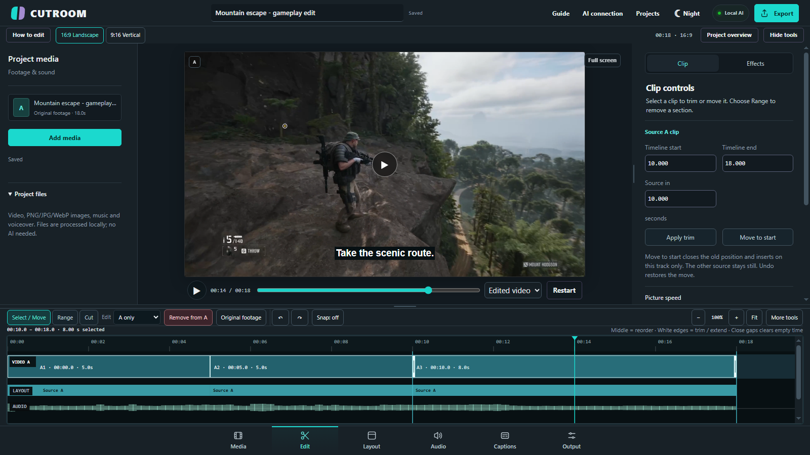
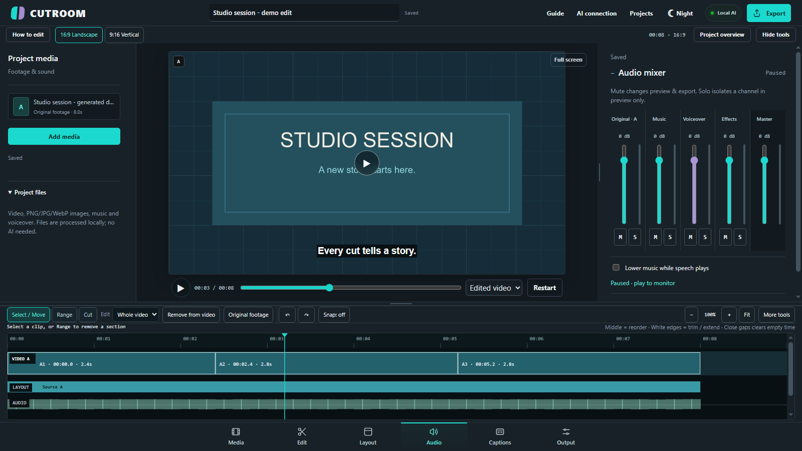
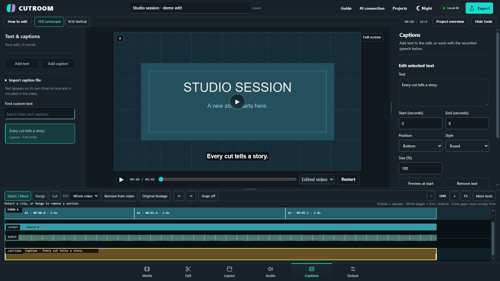

<p align="center">
  
</p>

<p align="center">
  <strong>A local-first video editor for YouTube, Shorts and Reels.</strong><br>
  Cut your recording. Shape the frame. Get the sound and captions right.
</p>

<p align="center">
  <a href="CHANGELOG.md"></a>
  <a href="docs/BETA_STATUS.md"></a>
  <a href="LICENSE"></a>
</p>

<p align="center">
  <a href="https://cutroom-studio.expo.app/downloads/CUTROOM-1.1-Beta-Windows.zip"><strong>Download Windows beta</strong></a> ·
  <a href="https://cutroom-studio.expo.app/downloads/CUTROOM-1.1-Beta-Mac.zip"><strong>Download Mac beta</strong></a> ·
  <a href="docs/PLATFORMS.md#linux-source-based-development-path">Linux source setup</a>
</p>

CUTROOM brings your camera recordings, screen captures and gameplay into an **editable timeline**. Work by hand, or ask optional AI to propose a first cut that you review and change. The application runs on your computer, with a browser interface and local MP4 rendering.

The source is MIT-licensed, with no CUTROOM subscription or export watermark. Optional cloud AI uses your own provider account; its quotas and charges are separate.

> **Current development preview:** the three screenshots below show a real local build captured on 4 October 2026. This interface is still being revised and **is not included in the published 1.1 Beta downloads**. All three show the same frame from a locally recorded gameplay project in the dark theme; they do not demonstrate AI editing quality.

<p align="center">
  <a href="docs/images/readme/development-editor-20261004.png"></a>
</p>

*Edit workspace — project media, player and timeline together. Click any screenshot to view it at full size.*

## From recording to MP4

1. **Import your footage.** Start with one recording, or add separate camera and screen sources.
2. **Build your edit.** Choose manual editing or review an AI-assisted draft. Split, trim and arrange clips; adjust framing and sound.
3. **Finish and review.** Add text or captions, choose landscape or vertical output, export an MP4 and watch the result.

[Open the user guide](docs/USER_GUIDE_EN.md) · [Keyboard shortcuts](docs/KEYBOARD_SHORTCUTS.md)

## Tools for the edit

- **Independent video tracks.** Cut and move sources A and B together or separately, with Undo/Redo and track protection. [Timeline controls](docs/INDEPENDENT_TRACKS.md)
- **Camera and screen layouts.** Set source roles, adjust framing and review synchronization.
- **Media and audio.** Add B-roll, images, music and voiceover. Source waveforms work without AI; mixer controls let you adjust levels and mute channels.
- **Text and captions.** Create text layers, import SRT/VTT captions and adjust wording, timing and style. AI transcription is optional.
- **Green screen and stabilization.** Apply Chroma Key to a selected source or imported video. Optional stabilization creates a separate local copy when the installed FFmpeg supports it and may crop the edges. [Green screen guide](docs/CHROMA_KEY.md) · [Stabilization guide](docs/STABILIZATION.md)
- **Local export.** Render landscape or vertical MP4 video, with resolution options from 720p to 4K and frame rates up to 60 FPS. Higher settings do not recover missing source detail.

<p align="center">
  <a href="docs/images/readme/development-audio-20261004.png"></a>
</p>

*Audio workspace, development preview — channel levels and mute controls beside the player. This capture is paused; Solo monitors a channel in preview only.*

<p align="center">
  <a href="docs/images/readme/development-captions-20261004.png"></a>
</p>

*Captions workspace, development preview — a manually added caption with editable wording and timing.*

## Install and start

| Platform | Download and launch | What to expect |
| --- | --- | --- |
| **Windows** | [Windows beta ZIP](https://cutroom-studio.expo.app/downloads/CUTROOM-1.1-Beta-Windows.zip). Extract the entire archive, then open **START CUTROOM.bat** beside **App**. | Source and launcher; fresh-computer and broad hardware testing remain ongoing. |
| **macOS** | [Mac beta ZIP](https://cutroom-studio.expo.app/downloads/CUTROOM-1.1-Beta-Mac.zip). Extract the entire archive, then open **START CUTROOM.command** beside **App**. | Targets macOS 15+ on Apple Silicon and Intel. Automated checks are separate from physical installation, Finder/Gatekeeper and Safari testing, which still need manual verification. |
| **Linux** | Use a source checkout and the commands below. | Development path; no Linux binary download or verified end-to-end Linux installation. |

Keep **App**, **START HERE.html** and the launcher together. **First setup needs internet** to obtain dependencies; Python, FFmpeg and AI models are not bundled in the ZIPs. The Mac launcher is unsigned and is not a notarized `.app`. Follow the [platform setup guide](docs/PLATFORMS.md) for prerequisites and security prompts.

Keep the launcher or terminal open while editing. If the browser does not open, go to **http://127.0.0.1:8765** once setup finishes. For updates, extract a fresh copy separately and back up your projects before migration. The older combined ZIP is also supported: open its `windows` or `mac` folder first.

### From source

Windows users can run `run_windows.bat` from the repository root. For Mac, follow the [Mac setup guide](docs/MAC_BETA.md).

On Linux, first install **Python 3.11 or 3.12** with `venv` and `pip`, **FFmpeg/FFprobe**, and **Bash**. In a writable checkout of this repository, run:

```sh
chmod +x setup_linux.sh run_linux.sh
bash setup_linux.sh
bash run_linux.sh
```

Setup creates a local virtual environment and installs Python dependencies. FFmpeg needs the encoding and subtitle filters described in the [Linux prerequisites](docs/PLATFORMS.md#linux-source-based-development-path).

## Choose how AI works

| Mode | What it does | What it needs |
| --- | --- | --- |
| **Manual editing** | You make the cuts, add media and captions, and export. | No AI model or provider account. |
| **Local AI** | Transcribes speech and can propose edits using models on your computer. | Separate model downloads, disk space and processing resources. Story AI also needs Ollama. |
| **Cloud AI — optional** | Uses Groq or a compatible provider for transcription and edit planning. | Your own API account, compatible models and explicit cloud consent. Provider limits and billing apply. |

Editing, preview generation and video export run locally. With cloud AI enabled, **selected audio chunks go to the provider for transcription; transcript text and editing instructions/context go there for planning**. These requests do not send video frames. Provider retention and privacy terms apply to the content you send.

Local models are separate downloads. Mac transcription currently runs on the CPU. A chat subscription does not provide API access, and a provider's free tier has usage limits.

[AI connections and privacy](docs/AI_CONNECTIONS.md) · [Model requirements](docs/MODELS.md)

## Beta expectations

Start with a short recording and keep your originals. Review transcripts, AI selections, source roles, synchronization and the exported MP4. AI offers a draft for you to edit; default YouTube cleanup is chronological, and editing presets do not establish editorial quality.

The editor has two main video sources plus media and text layers. Added layers stay within the existing edit and do not automatically follow source reordering. Automated checks and synthetic renders do not establish real-footage quality, installation on every computer or AI accuracy.

[Beta status](docs/BETA_STATUS.md) · [Known limits](docs/QUALITY_AND_LIMITS.md) · [Mac validation](docs/MAC_BETA.md) · [Changelog](CHANGELOG.md)

## Help improve CUTROOM

[Report an issue](https://github.com/VanoPeradze/cutroom/issues/new/choose) with your OS, browser, steps to reproduce and a short redacted error message. The [tester feedback guide](docs/BETA_FEEDBACK.md) explains what helps most.

Contributors can start with [development setup and checks](docs/CONTRIBUTING.md). CUTROOM uses Python, plain JavaScript and FFmpeg.

[Website](https://cutroom-studio.expo.app/) · [All guides](docs/README.md) · [Contributing](.github/CONTRIBUTING.md) · [Security reports](.github/SECURITY.md)

## License and credits

CUTROOM is released under the **[MIT License](LICENSE)**. Third-party tools and AI models retain their own licenses; see [third-party notices](docs/THIRD_PARTY_NOTICES.md).

Thanks to the open-source projects behind CUTROOM, including FFmpeg, faster-whisper, Ollama and ivrit.ai, and to Groq for providing a free API tier within its quotas. CUTROOM is independent and is not sponsored or endorsed by Groq.
